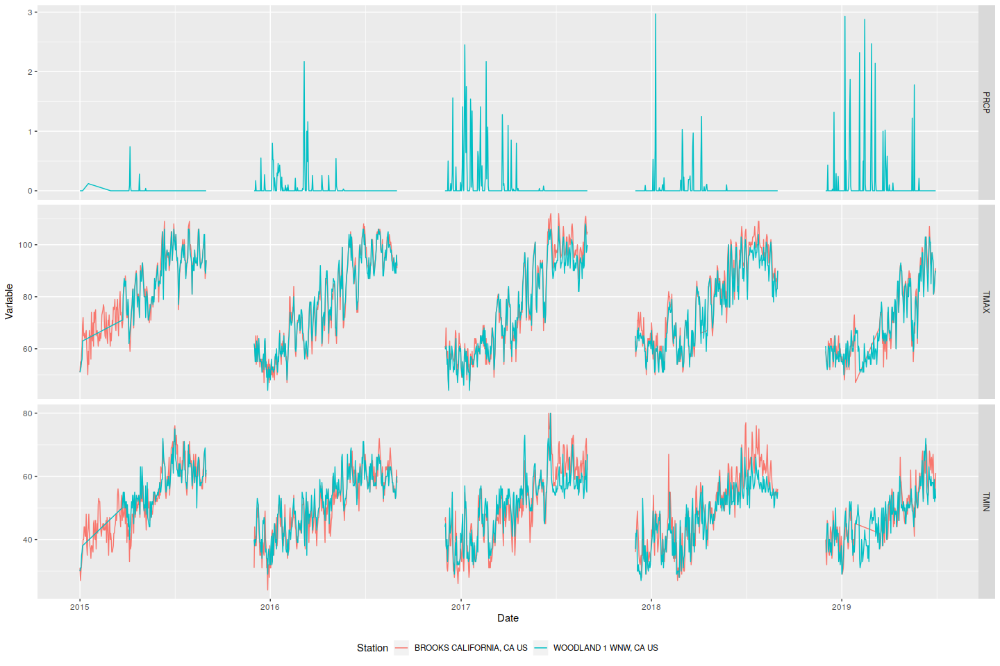
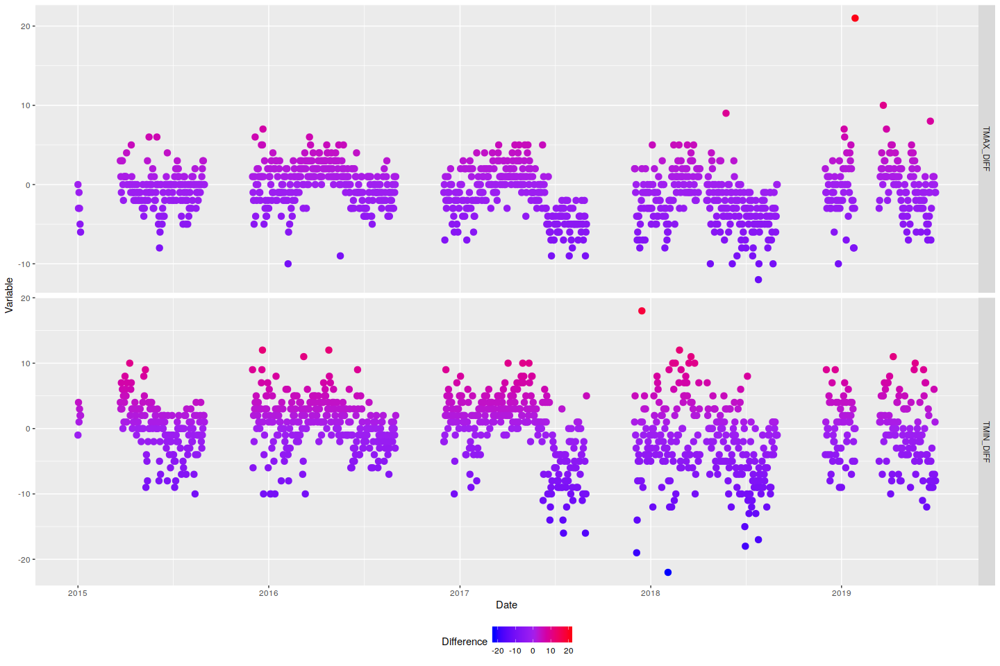
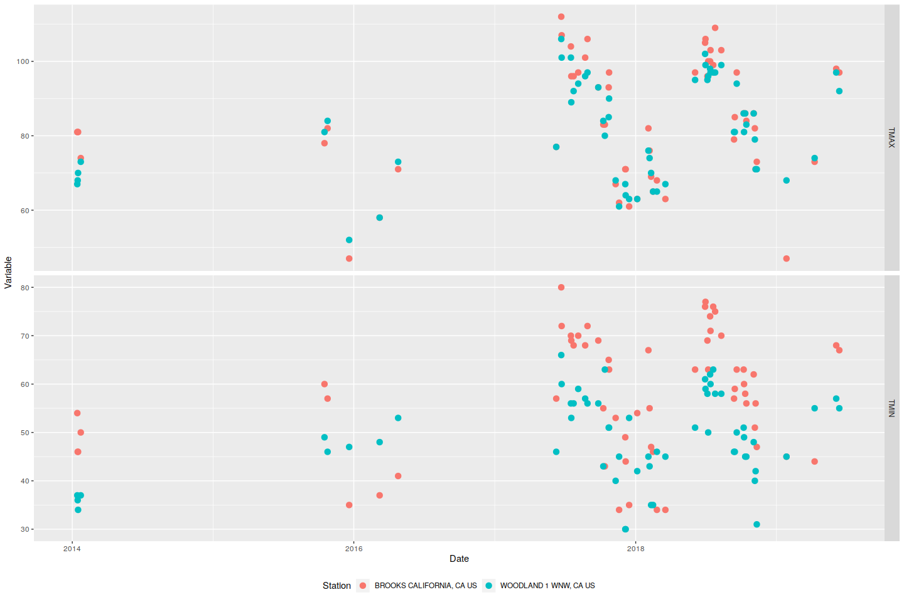

Matching stations and sites
================

This is the next step, matching the stations with the nesting
sites.

| Site               | lat                                             | long         | year.start |
| :----------------- | :---------------------------------------------- | :----------- | ---------: |
| Mace Blvd          | 38.509436                                       | \-121.669821 |       2015 |
| Russell Ranch      | 38.54321                                        | \-121.870175 |       2015 |
| Interdam           | 38.504983                                       | \-122.039681 |       2015 |
| Blue Oak           | 38.531671                                       | \-122.016396 |       2018 |
| Button & Turkovich | 38.55823                                        | \-121.939602 |       2015 |
| Cappel             | 38.519969                                       | \-122.009514 |       2018 |
| Joe Turkovich      | 38.539228                                       | \-121.904682 |       2018 |
| RH Phillips        | 38.801135                                       | \-121.99798  |       2018 |
| Matchbook          | 38.74883                                        | \-121.934838 |       2015 |
| Citrona            | 38.629189                                       | \-122.0105   |       2015 |
| Suisun Marsh       | 38.125629                                       | \-121.942967 |       2017 |
| Napa               | ???                                             | ???          |       2015 |
| Raptor center      | averages of yolo solano and sacramento counties | NA           |       1993 |

Let’s try to match up the sites with the nearest station. The last 2 we
won’t worry about for now; we’ll focus on the others.

| Site               | Station                  | Distance\_km |
| :----------------- | :----------------------- | -----------: |
| Mace Blvd          | DAVIS 1.7 SE, CA US      |     4.957555 |
| Russell Ranch      | DAVIS 6.3 W, CA US       |     2.547437 |
| Interdam           | WINTERS, CA US           |     5.842396 |
| Blue Oak           | WINTERS, CA US           |     3.442122 |
| Button & Turkovich | WINTERS, CA US           |     4.946529 |
| Cappel             | WINTERS, CA US           |     2.828113 |
| Joe Turkovich      | DAVIS 6.3 W, CA US       |     5.181966 |
| RH Phillips        | BROOKS CALIFORNIA, CA US |    14.512535 |
| Matchbook          | WOODLAND 1 WNW, CA US    |    14.249682 |
| Citrona            | WINTERS, CA US           |    11.909399 |
| Suisun Marsh       | WINTERS, CA US           |    44.533455 |

However, not all stations have the data that we need\! We need
precipitation (PRCP) and Daily temperature (TMAX, TMIN). All of these
stations have at least one of those values, but not all of them have all
three\! If we only look at stations that have all desired variable, we
go from 19 possibilities to three\!

| NAME                                 | LATITUDE |  LONGITUDE |
| :----------------------------------- | -------: | ---------: |
| WOODLAND 1 WNW, CA US                |  38.6829 | \-121.7940 |
| DAVIS 2 WSW EXPERIMENTAL FARM, CA US |  38.5349 | \-121.7761 |
| WINTERS, CA US                       |  38.5252 | \-121.9777 |

Matching that with the sites, this is the final
result:

| Site               | Station                              | Distance\_km |
| :----------------- | :----------------------------------- | -----------: |
| Mace Blvd          | DAVIS 2 WSW EXPERIMENTAL FARM, CA US |     9.669615 |
| Russell Ranch      | DAVIS 2 WSW EXPERIMENTAL FARM, CA US |     8.234170 |
| Interdam           | WINTERS, CA US                       |     5.842396 |
| Blue Oak           | WINTERS, CA US                       |     3.442122 |
| Button & Turkovich | WINTERS, CA US                       |     4.946529 |
| Cappel             | WINTERS, CA US                       |     2.828113 |
| Joe Turkovich      | WINTERS, CA US                       |     6.540072 |
| RH Phillips        | WOODLAND 1 WNW, CA US                |    22.041250 |
| Matchbook          | WOODLAND 1 WNW, CA US                |    14.249682 |
| Citrona            | WINTERS, CA US                       |    11.909399 |
| Suisun Marsh       | WINTERS, CA US                       |    44.533455 |

Now, it’s entirely possible that there are closer stations in another
county\! Or, you could get temperature from one station and
precipitation from another relatively close by\! Let’s look at the
observations for RH Phillips, where the closest station is Brooks (14.5
km, doesn’t have precipitation data), but the closest station with all
three variables is Woodland 1 WNW (22 km). Therefore, let’s compare the
data for both\! (Note that these plots only show December-August data)

The following plots show (top) precipitation, (middle) TMAX, and
(bottom) TMIN in the first figure, and the differences for (top) TMAX
and (bottom) TMIN between Woodland and Brooks. Note that both Woodland
and Brooks have some gaps in their data. Note that there are some times
when the magnitude of the difference is 20 degrees or
more\!\!

<!-- --><!-- -->

Let’s look at just the times when the temperature difference for either
the TMAX or TMIN exceeds 10 degrees. (Precipitation isn’t shown here
because we only had data from one of the stations)
<!-- --><!-- -->

We see that there are quite a few points with this sort of discrepancy,
which means that I’d be hesitant to use one as a substitute for the
other. I’d likely bring in at least one other dataset to verify which
one was correct. Note that topography can play a huge factor in
temperature differences, so it’s possible that we want to also try to
match elevation\!
