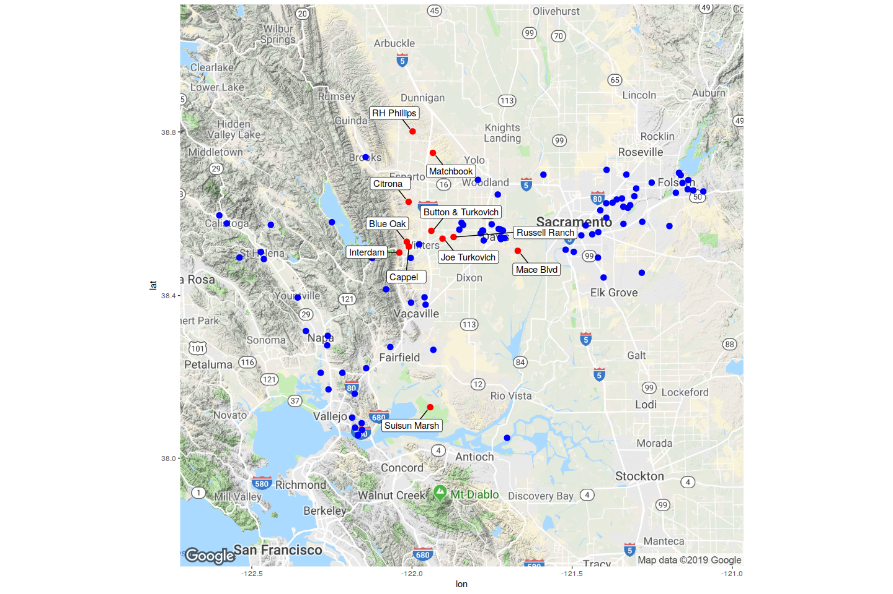
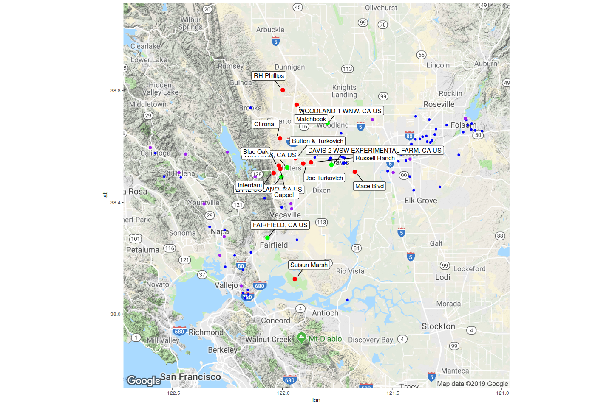
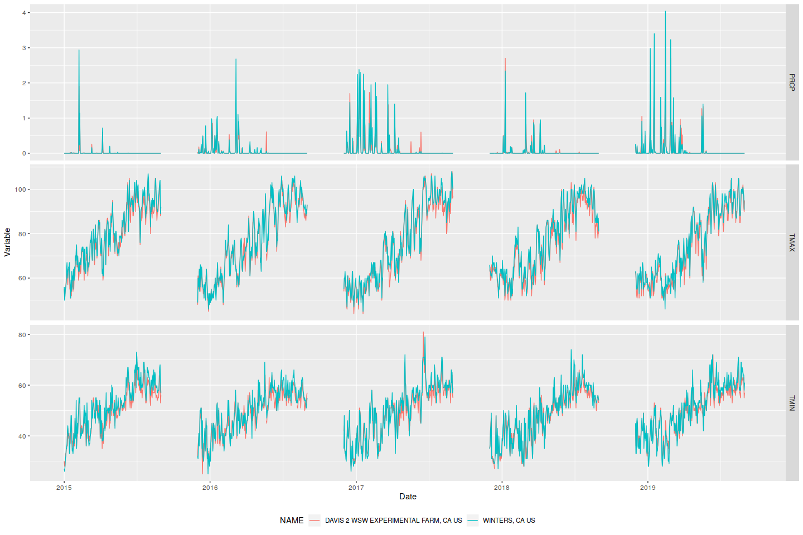

Stations and site part 2
================

    ## Google's Terms of Service: https://cloud.google.com/maps-platform/terms/.

    ## Please cite ggmap if you use it! See citation("ggmap") for details.

We now have data from Yolo, Sacramento, Solano, and Napa counties. The
blue dots indicate stations and the red dots indicate
    sites.

    ## Source : https://maps.googleapis.com/maps/api/staticmap?center=38.425618,-121.846&zoom=9&size=640x640&scale=2&maptype=terrain&key=xxx-GBgiOoyhaN1EOxSI2uUI

<!-- -->

These are the closest stations to the sites:

| Site               | Station                  | Distance\_km |
| :----------------- | :----------------------- | -----------: |
| Mace Blvd          | DAVIS 1.7 SE, CA US      |     4.957555 |
| Russell Ranch      | DAVIS 6.3 W, CA US       |     2.547437 |
| Interdam           | LAKE SOLANO, CA US       |     3.432181 |
| Blue Oak           | WINTERS, CA US           |     3.442122 |
| Button & Turkovich | WINTERS, CA US           |     4.946529 |
| Cappel             | WINTERS, CA US           |     2.828113 |
| Joe Turkovich      | DAVIS 6.3 W, CA US       |     5.181966 |
| RH Phillips        | BROOKS CALIFORNIA, CA US |    14.512535 |
| Matchbook          | WOODLAND 1 WNW, CA US    |    14.249682 |
| Citrona            | WINTERS, CA US           |    11.909399 |
| Suisun Marsh       | TRAVIS FIELD AFB, CA US  |    15.705639 |

And these are the stations with all three
variables:

| NAME                                   | LATITUDE |  LONGITUDE | COUNTY     |
| :------------------------------------- | -------: | ---------: | :--------- |
| WOODLAND 1 WNW, CA US                  | 38.68290 | \-121.7940 | YOLO       |
| DAVIS 2 WSW EXPERIMENTAL FARM, CA US   | 38.53490 | \-121.7761 | YOLO       |
| WINTERS, CA US                         | 38.52520 | \-121.9777 | YOLO       |
| NAPA STATE HOSPITAL, CA US             | 38.27770 | \-122.2647 | NAPA       |
| MARKLEY COVE, CA US                    | 38.49160 | \-122.1241 | NAPA       |
| CALISTOGA, CA US                       | 38.59610 | \-122.6013 | NAPA       |
| YOUNTVILLE, CA US                      | 38.39500 | \-122.3567 | NAPA       |
| LAKE BERRYESSA, CA US                  | 38.57944 | \-122.2500 | NAPA       |
| NAPA CO AIRPORT, CA US                 | 38.21020 | \-122.2847 | NAPA       |
| ANGWIN PACIFIC UNION COLLEGE, CA US    | 38.57300 | \-122.4405 | NAPA       |
| SAINT HELENA, CA US                    | 38.50660 | \-122.4713 | NAPA       |
| SACRAMENTO EXECUTIVE AIRPORT, CA US    | 38.50690 | \-121.4950 | SACRAMENTO |
| SACRAMENTO 5 ESE, CA US                | 38.55520 | \-121.4183 | SACRAMENTO |
| SACRAMENTO METROPOLITAN AIRPORT, CA US | 38.69556 | \-121.5897 | SACRAMENTO |
| FOLSOM DAM, CA US                      | 38.70000 | \-121.1667 | SACRAMENTO |
| VACAVILLE NUT TREE AIRPORT, CA US      | 38.37750 | \-121.9575 | SOLANO     |
| LAKE SOLANO, CA US                     | 38.49200 | \-122.0039 | SOLANO     |
| VALLEJO, CA US                         | 38.10000 | \-122.1869 | SOLANO     |
| FAIRFIELD, CA US                       | 38.27360 | \-122.0677 | SOLANO     |
| VACAVILLE, CA US                       | 38.39556 | \-121.9608 | SOLANO     |

This gives us a wider range of stations with all three variables (shown
in purple
    here).

    ## Source : https://maps.googleapis.com/maps/api/staticmap?center=38.425618,-121.846&zoom=9&size=640x640&scale=2&maptype=terrain&key=xxx-GBgiOoyhaN1EOxSI2uUI

<!-- -->
Matching that with the sites, this is the final
result:

| Site               | Station                              | Distance\_km |
| :----------------- | :----------------------------------- | -----------: |
| Mace Blvd          | DAVIS 2 WSW EXPERIMENTAL FARM, CA US |     9.669615 |
| Russell Ranch      | DAVIS 2 WSW EXPERIMENTAL FARM, CA US |     8.234170 |
| Interdam           | LAKE SOLANO, CA US                   |     3.432181 |
| Blue Oak           | WINTERS, CA US                       |     3.442122 |
| Button & Turkovich | WINTERS, CA US                       |     4.946529 |
| Cappel             | WINTERS, CA US                       |     2.828113 |
| Joe Turkovich      | WINTERS, CA US                       |     6.540072 |
| RH Phillips        | WOODLAND 1 WNW, CA US                |    22.041250 |
| Matchbook          | WOODLAND 1 WNW, CA US                |    14.249682 |
| Citrona            | WINTERS, CA US                       |    11.909399 |
| Suisun Marsh       | FAIRFIELD, CA US                     |    19.736354 |

And this is the map of the sites (red) and the closest stations (green)
with all three
    variables.

    ## Source : https://maps.googleapis.com/maps/api/staticmap?center=38.425618,-121.846&zoom=9&size=640x640&scale=2&maptype=terrain&key=xxx-GBgiOoyhaN1EOxSI2uUI

<!-- -->

Now let’s look at the difference between Winters and the Davis
Experimental Farm. Davis has an elevation of 18.3 feet while Winters has
an elevation of 41.1
feet.

<!-- -->
While they SEEM reasonably close, let’s check the magnitude of
difference for
each.

<!-- -->

That precipitation difference is not greatl the order of magnitude for
the differences is comparable to the amount of rain itself\! We’ll
likely want to stick to whichever station is closest, if possible (or do
a distance-weighted average). It’s not really surprising given the
difference in elevation (and Winters is closer to hillier terrain, which
impacts precipitation amounts).
